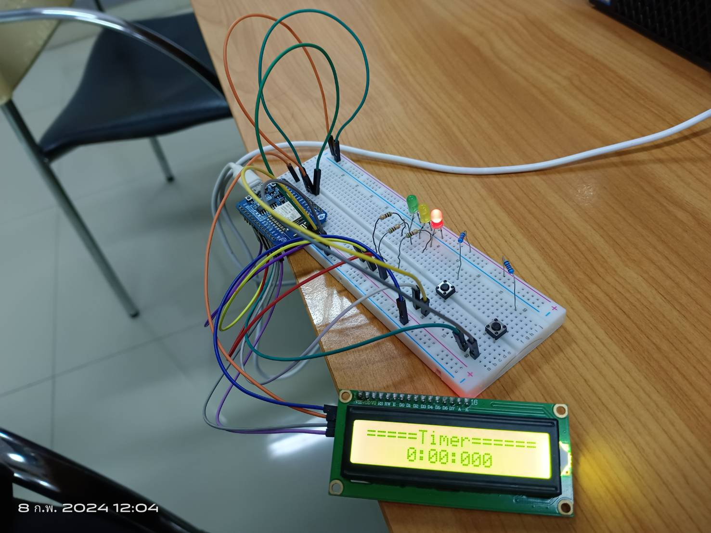
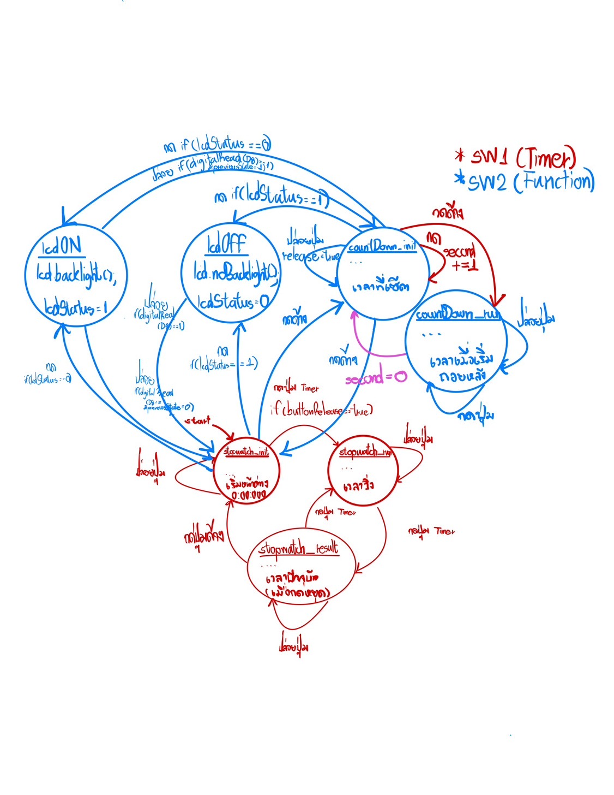

<h1>Stopwatch in Arduino!</h1>
<h2>Circuit</h2>

<h2>State Diagram</h2>

<h2>How to use (Thai)</h2>
<h3>วิธีใช้งาน</h3> 
=====Timer===== กด (SW1) 1 ครั้งตอน สถานะเริ่มต้น,สถานะรอ เพื่อจับเวลา 
&emsp;&emsp;&emsp;0:00:000&emsp;&emsp;&emsp;กด (SW1) 1 ครั้งตอน สถานะจับเวลา  เพื่อหยุดเวลา อยู่สถานะรอ 
&emsp;&emsp;&emsp;&emsp;&emsp;&emsp;&emsp;&emsp;&emsp;&ensp;&nbsp;กด (SW1) ค้าง 1 วิ ตอนอยู่ สถานะรอจับเวลา เพื่อรีเซ็ทเวลา ไปสถานะเริ่มต้น 
</ul> 
LED RED = สถานะเริ่มต้น 
LED GREEN = สถานะจับเวลา 
LED YELLOW = สถานะรอ 
---------------------------------------------------------------------------------- 
เปิด-ปิด ไฟจอ LCD  
เมื่ออยู่ในสถานะเริ่มต้น กด (sw2) 1 ครั้งเพื่อสลับ สถานะไฟ LCD (เปิด-->ปิด , ปิด-->เปิด) 
---------------------------------------------------------------------------------- 
เปลี่ยน MODE 
เมื่ออยู่ในสถานะเริ่มต้น,สถานะรอ กด (sw2) ค้าง 2 วิ เพื่อเปลี่ยนเป็นโหมดนับเวลาถอยหลัง,โหมดจับเวลา 
กด (SW1) 1 ครั้งตอน สถานะเริ่มต้น เพื่อตั้งเวลาเริ่มต้น  กด 1 ครั้งต่อ 1 วิ 
กด (SW1) ค้าง ตอน สถานะเริ่มต้น เพื่อเริ่มนับเวลาถอยหลัง   
กด (SW1) 1 ครั้งตอน นับเวลาถอยหลัง เพื่อหยุดการนับถอยหลังชั่วคราว   กดอีกครั้งเพื่อนับต่อ 
